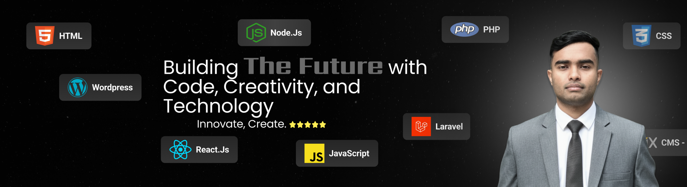

<h1 align="center">Hi 👋, I'm Emon Shikder</h1>
<h2 align="center">Laravel Developer | Backend Engineer | Researcher</h2>

I'm a passionate **Laravel developer and backend engineer**, specializing in building scalable web applications, RESTful APIs, and database-driven systems. I have strong experience with **Laravel ecosystem**, system architecture, and API development, and I actively work on full-stack and research-driven projects.

🔭 **Key Focus Areas:**  

- **Programming Languages:** PHP, JavaScript, Python, C, C++, Java  
- **Backend Technologies:** Laravel, REST API, MVC Architecture, Node.js  
- **Frontend Technologies:** Blade, React, Next.js, Tailwind CSS, Bootstrap  
- **Database Management:** MySQL, PostgreSQL, SQLite, MongoDB  
- **Tools & Platforms:** Git, GitHub, Firebase, Figma, Adobe XD, Vercel  

🔬 **In Research:**  
Medical Image Analysis, Deep Learning, and Disease Classification

📫 **How to reach me:** [codingwithemon@gmail.com](mailto:codingwithemon@gmail.com)  

---

### 🌐 Socials:

---

### 💻 Tech Stack:

---

### 📊 GitHub Stats

  
  

  

---

###  My Contributions

  
  

---

### ✍️ Random Dev Quote

  

